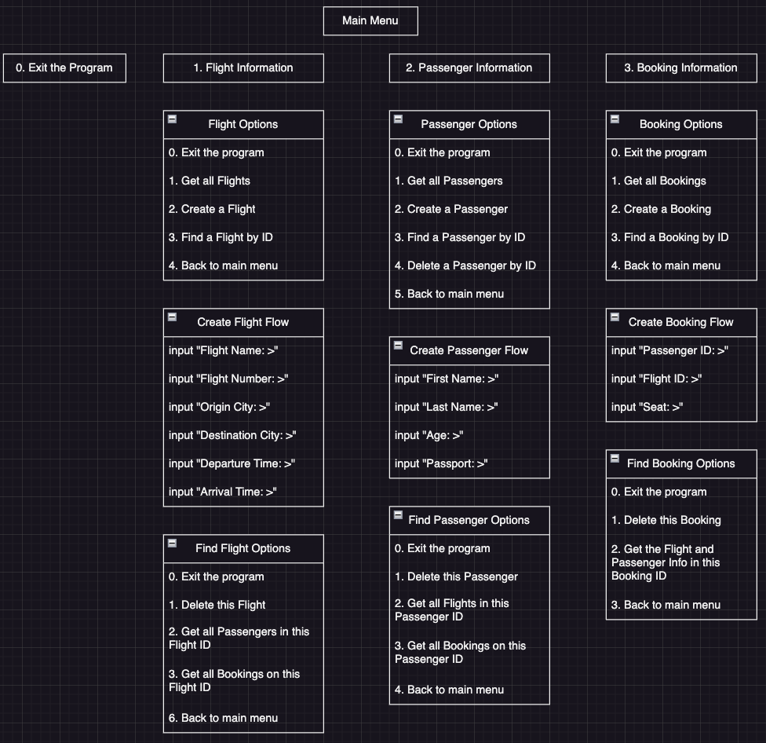
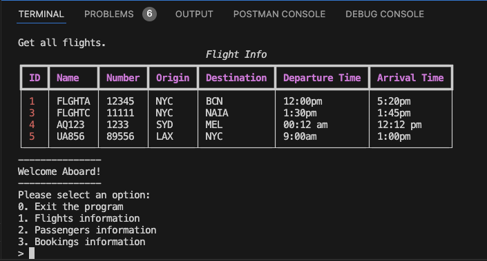

# Book My Wings

## Phase 3 CLI + ORM Project

## Introduction

Welcome aboard!

**"Book My Wings"** is a user-friendly CLI + ORM designed to simplify your travel planning. Whether you're looking for available flights, signing up as a passenger, or making a booking, this app makes the process quick and hassle-free. With a seamless interface and real-time flight options, **"Book My Wings"** ensures you can easily find and secure your next flight in just a few taps. Travel made simple using a CLI.

---

## Generating Your Environment

1. Fork and clone this repository:

Clone this repository in your terminal: git@github.com:jajaninnin/python-p3-cli-flights-project.git

Navigate to the project directory in your terminal: cd python-p3-v2-final-project-template

2. Install and run the commands in your terminal:

```console
pipenv install
```

3. Run or activate your virtual environment in your terminal:

```console
pipenv shell
```

4. Change your directory in your terminal:

```console
cd lib
```

5. Run the python CLI file in your terminal:

```console
python cli.py
```

**OPTIONAL:** You can skip step 4 and 5, by directly running the CLI file from your virtual environment by typing this on your terminal:

```console
python lib/cli.py
```

You can only pick either step 4&5 or Optional route.

---

## Flow Chart 

Here is the flow chart of the CLI:



---

## How to Use the CLI

When you run the CLI file, it will ask you to input from the choices given. 

For example, to view all the available flights:

On the Main menu, click **"1. Flights Information"**

The CLI will give you different options, then you have to type in **"1. Get all Flights"**

That will give you the input of all the flights the are available.



You can also choose **"Back to Main Menu"** to view **"2. Passenger Information"** or **"3. Bookings Information"**

---

## Key Features

### Flight Information

Located as option 1 on Main menu, the user has the capability to view all flights, create a flight, find a flight by ID, and go back to main menu.

If the user picked "Create a Flight", the use has to input all the information needed namely, flight name, flight number, origin city, destination city, departure time, and arrival time.

If the user picked "Find a Flight by ID", the user has to input a valid flight ID. Once the flight has been located, the user has then more options for that specific flight with the ID inputed, like deleting the flight, getting all the passengers of that flight, and getting all the bookings for that flight. 

### Passenger Information

Located as option 2 on Main menu, the user has the capability to view all passengers, create a passengers, find a passengers by ID, and go back to main menu.

If the user picked "Create a passenger", the use has to input all the information needed namely, first name, last name, age, and passport number.

If the user picked "Find a passenger by ID", the user has to input a valid passenger ID. Once the passenger has been located, the user has then more options for that specific passenger with the ID inputed, like deleting the passenger, getting all the flights of that passenger, and getting all the bookings for that passenger. 

 ### Booking Information

Located as option 3 on Main menu, the user has the capability to view all bookings, create a booking, find a booking by ID, and go back to main menu.

If the user picked "Create a booking", the use has to input all the information needed namely, related passenger ID, related flight ID, and seat.

If the user picked "Find a booking by ID", the user has to input a valid booking ID. Once the booking has been located, the user has then more options for that specific booking with the ID inputed, like deleting the booking, getting all the flight and passenger information of that booking ID and going back to main menu. 

---

## Contributions

We welcome contributions!

---

## Thank you for visiting!
